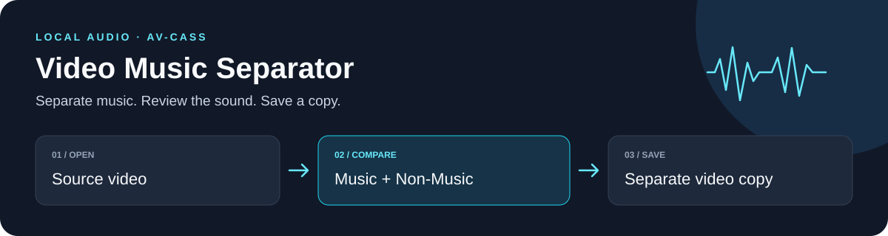
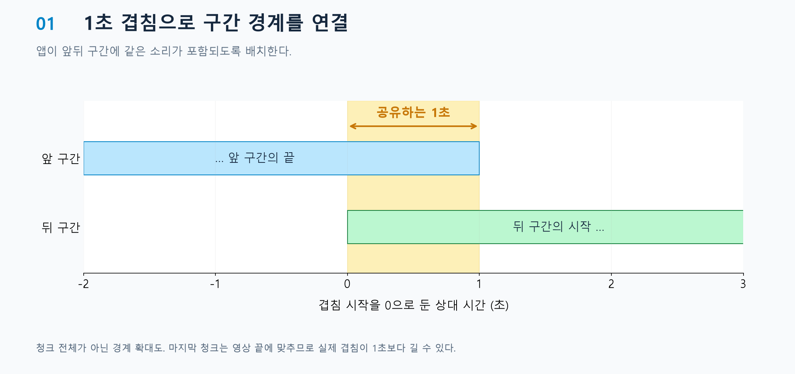
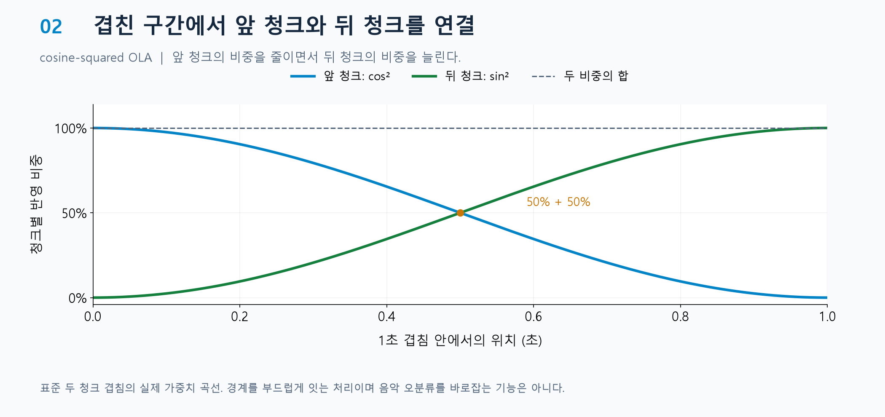
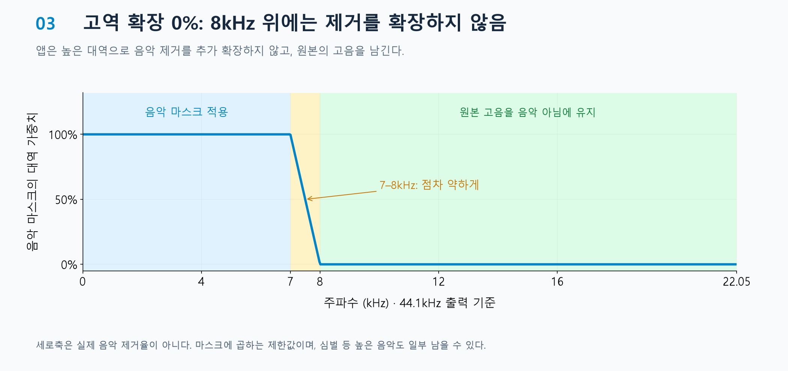
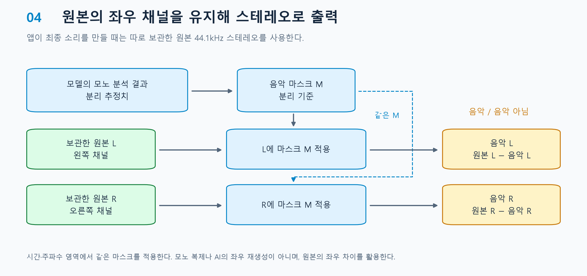
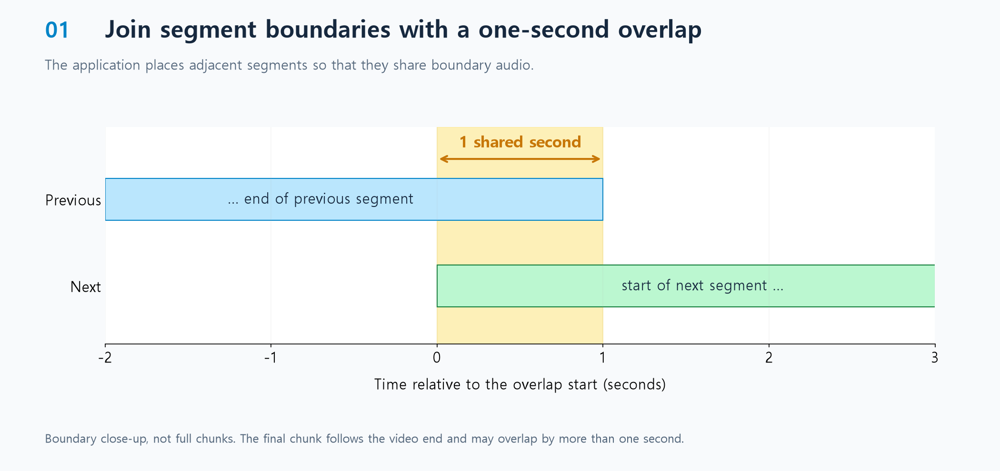
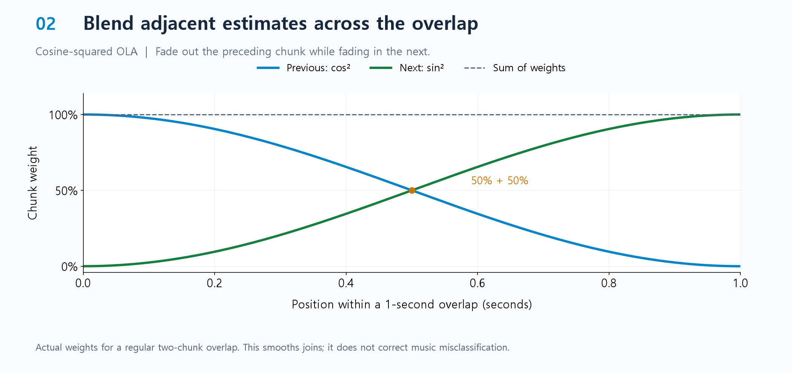
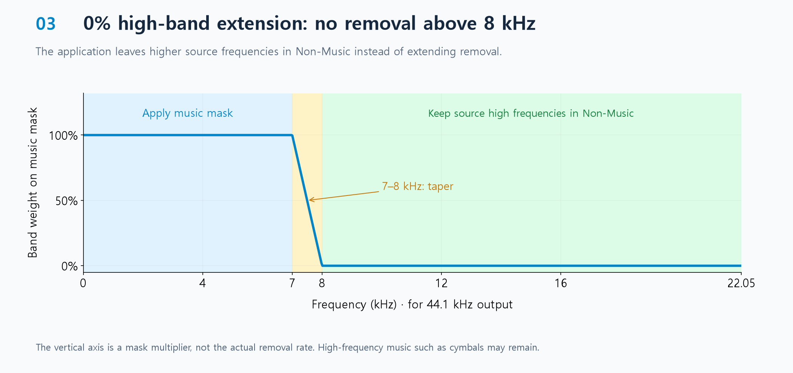
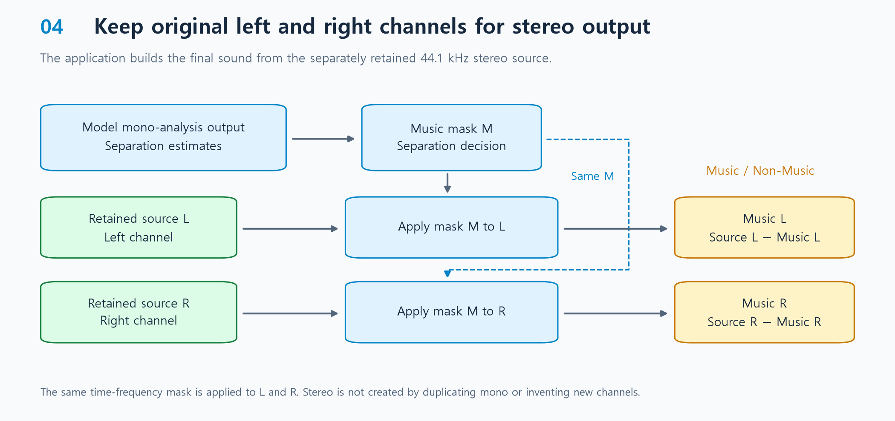

<a id="top"></a>

# 영상 음악 분리·제거기 / Video Music Separator



[](#한국어)
[](https://github.com/pantheon5100/AVCASS)
[](LICENSE)
[](docs/DISTRIBUTION_CHECKLIST.md)

**[한국어](#한국어) · [English](#english)**

## 한국어

> [!IMPORTANT]
> **설치 파일 공개 보류:** AV-CASS 연구진의 서면 허가 범위가 확인될 때까지 설치본과 AI 런타임 릴리스를 Draft로 보관한다. 소스 코드는 공개 상태로 유지하며 로컬 개발과 개인 사용을 계속한다. 이미 설치된 앱은 계속 작동하지만, 기존 설치기를 통한 신규 설치·런타임 재다운로드는 현재 사용할 수 없다.

Video Music Separator는 영상에 섞인 배경음악을 줄이거나 제거하는 Windows용 GUI 앱이다. 영상 장면과 오디오를 함께 분석해 소리를 `음악`과 `음악 아님`으로 나누고, 두 결과를 직접 비교해 들은 뒤 음악을 끈 영상 사본을 저장할 수 있다. 원본 영상은 수정하지 않으며 처리 속도보다 분리 품질을 우선한다.

- 현재 앱·설치본 버전: `0.2.9` (미서명, 설치 릴리스 Draft)
- 제작: [@ms-0606](https://www.youtube.com/@ms-0606) × OpenAI Codex

[기능](#ko-features) · [사용 방법](#ko-usage) · [분리 원리](#ko-separation) · [한계](#ko-limits) · [설치 참고](#ko-installation) · [개발·빌드](#ko-layout) · [라이선스](#ko-license)

<a id="ko-features"></a>

### 핵심 기능

| 기능 | 설명 |
| --- | --- |
| 🎬 시청각 분석 | 영상과 오디오를 함께 분석하는 AV-CASS·CAVP 기반 음악 분리 |
| 🎧 스테레오 출력 | AI 분리 결과를 마스크로 변환해 원본 44.1kHz 스테레오의 채널·공간감·위상 보존 |
| 🔊 비교 재생 | 음악과 음악 아님 트랙의 개별 미리듣기 및 음악을 끈 전체 영상 확인 |
| 💾 사본 저장 | 원본을 덮어쓰지 않는 음악 제거 사본 저장 |
| 🔒 로컬 처리 | 영상·오디오를 외부로 전송하지 않는 로컬 처리 |

<a id="ko-usage"></a>

### 사용 방법

1. `영상 열기`를 눌러 처리할 클립을 선택한다.
2. `영상에서 음악 분리`를 눌러 분석을 시작한다.
3. 음악과 음악 아님 행의 `듣기`를 눌러 각 결과를 확인한다. 같은 버튼을 다시 누르면 재생이 멈추고, 미리보기 아래 슬라이더로 원하는 위치를 탐색할 수 있다.
4. `음악 (BGM)` 행에서 `뮤트`를 누른다.
5. `전체 영상 재생`을 눌러 음악이 빠진 영상과 남은 소리를 함께 확인한다.
6. 결과가 만족스러우면 창 아래의 `사본 저장`을 누른다. 앱은 원본 옆에 `<원본이름>_음악제거.<원본확장자>`를 만들며, 같은 이름이 있으면 `_2`, `_3`처럼 번호를 붙여 기존 파일을 보존한다.

| 원본 형식 | 저장 영상 | 처리된 오디오 |
| --- | --- | --- |
| MP4 · MOV · MKV · M4V | 원본 영상 스트림 복사 | AAC |
| WebM | 원본 영상 스트림 복사 | Opus |
| AVI | 원본 영상 스트림 복사 | PCM |

앱은 첫 미리보기 때 420×236·24fps 프록시를 만든 뒤 재사용한다. 이 프록시는 재생에만 사용하며 저장본에는 포함하지 않는다. 사본은 원본 확장자(MP4·MOV·MKV·AVI·WebM·M4V)를 유지하고 원본 영상 스트림을 재인코딩 없이 복사한다. 처리한 오디오는 WebM에서 Opus, AVI에서 PCM, 나머지 형식에서 AAC로 저장한다. 오디오 코덱과 컨테이너의 모든 메타데이터까지 원본과 동일하게 보존하는 기능은 아니다. 미리보기는 오디오가 영상보다 짧아도 무음을 채워 영상 끝까지 재생한다.

영상 미리보기 오른쪽에서 `한국어 / English`를 선택하면 창 제목, 버튼, 상태 안내, 결과 표, 경고창과 앱 정보·라이선스·출처 안내가 즉시 해당 언어로 바뀐다.

전체 볼륨 슬라이더는 앱을 시작할 때 100으로 설정되며 원본·뮤트 믹스·두 분리본에 공통 적용된다. AV-CASS 실행 경로는 휴대용 폴더 안에서 자동으로 관리된다.

작업 중 창을 닫으면 분리·영상 처리 프로세스를 중단하고 정리가 끝난 뒤 종료한다. 설치 중에는 동의 항목을 다시 조작해도 설치 작업이 중복 시작되지 않는다.

처리 중에는 원본 옆에 `<영상이름>_sound_work_<난수>` 임시 폴더가 생긴다. 앱은 실행별 난수와 원본 경로가 기록된 소유 표식을 확인해 이번 실행이 만든 폴더만 삭제한다. 기존 `<영상이름>_sound_work` 폴더나 다른 파일은 재사용하거나 삭제하지 않는다. 최종 영상 저장과 확인이 끝나면 임시 폴더를 정리하고, 저장이 실패하거나 취소됐거나 소유 표식이 맞지 않으면 진단을 위해 남겨 둔다.

입력은 로컬 고정 디스크의 지원 미디어 형식만 허용하며 UNC·네트워크 드라이브·재분석 지점·재생목록 형식을 거부한다. 한 번의 입력은 최대 10분, 영상은 최대 7680×4320, 오디오는 최대 8채널·192kHz다. FFmpeg 메모리 할당과 분석량, 외부 도구 로그 크기, 작업자 로그 한 줄·대기 큐에도 상한을 적용한다.

<a id="ko-separation"></a>

### 음악·비음악 분리 원리

이 앱은 모델의 모노 분석에서 얻은 분리 추정치를 받아 구간별로 연결하고, 이를 음악 마스크로 변환해 보관한 원본 스테레오에 적용한다. 아래는 앱에 적용한 연결·고역·출력 처리 방식이다.

#### 1. 1초 겹침 — 경계 구간을 공유

앱은 인접 처리 구간(청크)에 같은 1초가 포함되도록 배치한다. 겹친 부분에는 앞뒤 두 구간의 분리 결과가 생기며, 이를 OLA로 연결한다.



그림은 청크 전체가 아닌 일반적인 경계 주변을 확대해 보여준다. 마지막 청크는 영상 끝에 맞춰 배치하므로 실제 겹침이 1초보다 길어질 수 있다.

#### 2. cosine-squared OLA — 앞뒤 결과를 부드럽게 연결

OLA는 겹친 결과에 서로 다른 비중을 주어 더하는 방식이다. 겹침의 시작에서는 앞 청크를 많이 반영하고, 끝으로 갈수록 뒤 청크를 많이 반영한다. 일반적인 두 청크의 겹침에서는 앞쪽 `cos²`와 뒤쪽 `sin²` 곡선이 중간에서 각각 50%가 된다.



청크 사이의 급격한 변화를 줄이기 위한 연결 처리다. 곡선의 합이 100%라는 것은 반영 비중의 합을 뜻하며, 결과 소리의 크기가 항상 일정하거나 음악 오분류가 해결된다는 뜻은 아니다. 연결된 분리 결과로 최종 음악 마스크를 만든다.

#### 3. 고역 확장 0% — 높은 소리에 제거를 추가 확장하지 않음

앱은 음악 마스크의 대역 가중치를 7~8kHz에서 점차 낮추고, 8kHz 위에서는 0으로 둔다. 이 영역의 원본 소리는 음악 아님 트랙에 남는다.



여기서 0%는 고음의 음량을 0으로 만든다는 뜻이 아니라, 고음으로 음악 제거를 추가 확장하지 않는다는 뜻이다. 그래프의 세로축도 실제 제거율이 아니라 음악 마스크에 곱하는 대역 가중치다. 높은 효과음과 함께 심벌 같은 음악 성분도 일부 남을 수 있다.

#### 4. 스테레오 출력 — 보관한 원본의 좌우 채널을 사용

앱은 최종 출력에 사용할 44.1kHz 스테레오 소리를 따로 보관한다. 모델의 모노 분석에서 얻은 분리 추정치로 음악 마스크를 계산하고, 원본 왼쪽(L)과 오른쪽(R)에 동일하게 적용한다. 두 채널의 입력 소리는 서로 다르므로 같은 마스크를 적용해도 좌우 출력이 같은 모노가 되지는 않는다.



원본의 좌우 차이와 위상 정보를 활용하고, 음악 아님은 각 채널에서 `원본 - 음악`으로 만든다. 두 트랙을 합치면 계산 오차 범위에서 보관한 스테레오로 돌아온다. 다만 음악으로 잘못 분류된 효과음은 함께 줄어들 수 있으므로, 이것이 모든 효과음과 공간감의 완전한 보존을 보장하지는 않는다.

모델 출처: [AV-CASS 프로젝트](https://cass-flowmatching.github.io/) · [논문](https://mm.kaist.ac.kr/pubs/pdfs/zhang26a.pdf) · [공식 소스](https://github.com/pantheon5100/AVCASS). 이 앱은 연구진의 공식 앱이 아니며, 제휴하거나 보증받지 않았다.

<a id="ko-limits"></a>

### 한계

- 로컬 일반 파일만 입력할 수 있고 FFmpeg 계열 입력 프로토콜은 `file`로 제한된다. 한 번에 처리할 수 있는 영상은 최대 10분이며, 더 긴 영상은 나눠야 한다. 처리 전에 예상 임시 공간과 2GB 안전 여유를 확인한다.
- 음악/비음악 분리는 세부 소리 이름별 독립 추출보다 안정적이지만 AI 분리이므로 100% 무누출을 보장하지 않는다.
- 매우 작은 음악, 음악처럼 반복되는 효과음, 노래·신음처럼 음악과 사람 발성의 경계가 애매한 소리는 반대 트랙에 일부 남을 수 있다.
- 최종 출력은 음악 마스크를 보관한 원본 스테레오에 적용한다. 기본 고역 처리에서는 8kHz 초과 성분을 음악 아님 쪽에 남기므로, 높은 음악 성분도 일부 남을 수 있다.
- 저장 전에는 반드시 음악 행과 음악 아님 행을 각각 들어보고, 음악 뮤트 전체 재생까지 확인해야 한다.

<a id="ko-installation"></a>

### 설치 안내

현재 공개 설치 파일을 제공하지 않는다. 아래 내용은 기존 설치본의 구조와 공개 재개 후 설치 절차를 위한 참고 문서이며, 현재 다운로드 가능하다는 의미가 아니다.

<details>
<summary>기존 설치본 안내와 공개 재개 후 절차 펼치기</summary>

설치 ZIP을 모두 풀면 앱 실행 파일과 필수 구성요소 설치 파일이 함께 나온다. 두 파일을 같은 폴더에 둔 상태에서 **설치 파일을 먼저 실행**한다.

#### 1. 설치 전 확인

| 항목 | 요구사항 |
| --- | --- |
| 운영체제 | Windows 64비트. 현재 빌드와 동작 확인 환경은 Windows 11이다. |
| GPU | CUDA를 사용할 수 있는 NVIDIA GPU가 필요하다. CPU 전용 실행은 지원하지 않는다. 최소 VRAM은 아직 검증된 지원 기준을 정하지 않았다. |
| 저장 공간 | 첫 설치 때 약 5.9GB를 내려받으며, 압축 해제와 설치 중에는 약 15GB의 여유 공간을 권장한다. |
| 인터넷 | 첫 설치, 재설치 또는 런타임 업데이트 때 필요하다. 설치가 끝난 뒤 일반적인 영상 분리·저장에는 필요하지 않다. |
| GitHub 계정·CLI | 기존 설치기는 GitHub 인증을 지원하지 않는다. 런타임이 Draft인 동안 새 다운로드는 사용할 수 없다. |
| Python·FFmpeg | 최종 사용자가 별도로 설치할 필요가 없다. 설치 프로그램이 고정된 AI Python 실행환경과 Gyan FFmpeg 9.0.1 GPL Essentials 정적 빌드를 내려받는다. |
| 설치 위치 | ZIP 안에서 직접 실행하지 말고, 문서 폴더처럼 사용자가 쓸 수 있는 일반 폴더에 전체 압축을 푼다. |

#### 2. Windows 설치 파일 다운로드

`installer-v0.2.9`와 이전 `installer-v0.2.7`, `runtime-v0.2.0`을 GitHub Draft로 전환했다. 일반 사용자를 위한 다운로드 링크는 제공하지 않는다. 기존 0.2.9 Draft에 보관된 파일명은 다음과 같다.

- `video-music-separator-0.2.9-windows-x64.zip`
- 같은 이름의 `.sha256` 파일

이전 `0.2.3`, `0.2.5`, `0.2.6` 자산은 설치용으로 제공하지 않는다. `0.2.5`는 깨끗한 설치 검증에 실패했고, `0.2.6`은 원본 영상보다 오디오가 짧을 때 끝 프레임을 자르는 문제가 있어 GitHub Draft로 전환했다.

보관 중인 `0.2.9` 설치본에는 코드 서명이 없으므로 Windows가 게시자를 확인할 수 없고 SmartScreen 경고가 나타날 수 있다. 이 프로젝트는 Windows 배포본에 코드 서명 인증서를 적용할 계획이 없다. 다음 순서로 출처와 파일을 먼저 확인한 뒤 실행한다.

1. 기존에 공식 GitHub Release에서 받은 ZIP인지 확인하고 `.sha256` 파일로 ZIP 무결성을 검증한다.
2. `video-music-separator-setup.exe`를 실행했을 때 `Windows의 PC 보호` 창이 나타나면 `추가 정보`를 누른다.
3. 앱 이름이 `video-music-separator-setup.exe`이고 게시자가 `알 수 없는 게시자`로 표시되는지 확인한 뒤 `실행`을 누른다.
4. 설치가 끝난 뒤 `video-music-separator.exe`에도 같은 경고가 나타나면 앱 이름을 확인하고 같은 방법으로 실행한다.

SmartScreen이나 Smart App Control을 끄지는 않는다. `실행` 선택이 보이지 않으면 조직의 보안 정책이나 Smart App Control이 미서명 앱 실행을 차단한 환경일 수 있으며, 이 배포본은 해당 환경에서 실행할 수 없다. 앱 ZIP 안의 `docs/SHA256SUMS.txt`에서는 두 EXE의 해시를 추가로 확인할 수 있다. 자세한 동작은 Microsoft의 [SmartScreen 앱 평판 안내](https://learn.microsoft.com/windows/apps/package-and-deploy/smartscreen-reputation)와 [Smart App Control 안내](https://support.microsoft.com/windows/security/threat-malware-protection/smart-app-control-frequently-asked-questions)에서 확인할 수 있다.

GitHub가 자동으로 추가하는 `Source code (zip)`과 `Source code (tar.gz)`는 설치 파일이 아니므로 받지 않는다.

설치 ZIP에는 `video-music-separator-setup.exe`와 `video-music-separator.exe`가 함께 들어 있다. 두 EXE는 반드시 같은 폴더에 두며, AI Python 환경·AV-CASS 코드·모델·FFmpeg는 설치 프로그램이 별도로 내려받는다.

#### 3. 설치 순서

1. 내려받은 앱 ZIP을 새 폴더에 **모두 압축 해제**한다.
2. `video-music-separator-setup.exe`와 `video-music-separator.exe`가 같은 폴더에 있는지 확인한다.
3. 같은 Release에서 받은 `.sha256` 파일로 ZIP의 체크섬을 확인한다. 값이 다르면 실행하지 않는다.
4. **`video-music-separator-setup.exe`를 먼저 실행한다.**
5. 설치 화면 오른쪽 위에서 `한국어 / English`를 선택할 수 있다. 약 5.9GB의 다운로드 용량, 다운로드 출처, 모델 이용조건, 개인정보 안내와 사용자 책임을 읽고 동의한 뒤 `설치 시작`을 누른다.
6. 모든 항목의 다운로드와 SHA-256 검증이 완료될 때까지 기다린다.
7. 설치 완료 안내가 나오면 `video-music-separator.exe`를 실행한다.

> **설치 파일 공개 보류:** AV-CASS 연구진의 서면 허가 범위가 확인될 때까지 설치본과 AI 런타임 릴리스를 Draft로 보관한다. 소스 코드는 공개 상태로 유지하며 로컬 개발과 개인 사용을 계속한다. 이미 설치된 앱은 계속 작동하지만, 기존 설치기를 통한 신규 설치·런타임 재다운로드는 현재 사용할 수 없다. 진행 상태는 [배포 체크리스트](docs/DISTRIBUTION_CHECKLIST.md)에서 관리한다.

#### 4. 설치 프로그램이 내려받는 항목

1. 다음 항목을 지정 배포처에서 내려받는다.
   - AI Python 실행환경: `runtime-v0.2.0`의 고정된 두 분할 파일. 현재 Draft로 보관되어 기존 설치기에서 새로 받을 수 없다.
   - AV-CASS `av_cass_checkpoint.pt`: AV-CASS 공식 Google Drive
   - CAVP `cavp_epoch66.ckpt`: Diff-Foley 공식 Hugging Face의 고정 커밋
   - FFmpeg: Gyan FFmpeg 9.0.1 release essentials GPLv3 정적 빌드의 고정 URL
2. AI 실행환경과 모델은 고정된 크기·SHA-256을 확인한다. FFmpeg는 앱에 고정된 아카이브 URL·크기·SHA-256과 세 실행 파일 각각의 크기·SHA-256을 실행 전에 확인하고, 그 뒤 빌드 옵션도 검증한다.
3. 중단된 다운로드는 `.part` 파일에서 이어받으며, 모든 파일은 검증이 끝난 뒤에만 실제 설치 위치로 교체한다.

설치 화면에는 다운로드 출처, 적용되는 이용조건, 외부 통신 정보와 사용자 책임이 표시된다. 사용자가 이를 확인하고 동의해야 설치를 시작할 수 있다. Video Music Separator는 AV-CASS 연구진 또는 관련 기관의 공식 앱이 아니며 제휴하거나 보증받지 않았다.

설치 파일은 모델이나 FFmpeg를 이 저장소 또는 별도 서버에서 재배포하지 않는다. AI 실행환경·모델의 파일 내용이 고정 체크섬과 다르거나, FFmpeg가 고정된 9.0.1 아카이브 및 실행 파일 해시·GPL Essentials 빌드 조건과 다르면 설치를 중단한다. AI 실행환경은 앱 소스에 고정한 전체 보호 파일 트리 지문과 비교하고, Python 작업자를 시작할 때마다 다시 해시한다. 수정 가능한 사용자별 기록은 신뢰 기준으로 사용하지 않는다. 모델 파일은 각각의 고정 크기·SHA-256으로 별도 검증한다. 설치 결과와 실제 버전·출처·체크섬은 앱 폴더의 `docs/runtime-assets.json`에 기록한다.

앱은 검증된 체크포인트를 읽을 때도 PyTorch의 제한된 `weights_only` 모드를 사용하며, 각 공식 체크포인트에 필요한 최소 메타데이터 형식만 허용한다. 따라서 일반 Python 객체를 제한 없이 역직렬화하지 않는다.

보관된 앱 ZIP과 별도 AI 실행환경 자산은 예전 AudioSep/BandIt 코드·가중치와 해당 GPL 의존성인 `pedalboard`를 포함하지 않는다. 실제 설치되는 Python 패키지 목록은 앱 ZIP 안의 `docs/PYTHON_PACKAGES_NOTICES.md`, 기계 판독 목록은 `docs/PYTHON_PACKAGES_INVENTORY.json`, 각 라이선스 전문은 `docs/licenses/python/`에서 확인할 수 있다.

#### 5. 설치 문제 해결

- 현재 `runtime-v0.2.0`은 허가 대기로 Draft 상태다. AI 실행환경 접근 오류는 공개 보류에 따른 제한일 수 있으며, 기존 설치기는 Draft 다운로드나 GitHub 로그인을 지원하지 않는다. 이 오류를 해결하기 위해 임의로 릴리스를 공개하지 않는다.
- 설치 파일을 ZIP 안에서 직접 실행했거나 `Program Files`처럼 쓰기가 제한된 위치에 두었다면, 폴더 전체를 문서 폴더 같은 사용자 쓰기 가능 위치로 옮긴 뒤 다시 실행한다.
- 다운로드가 중단되면 같은 설치 파일을 다시 실행한다. 검증된 파일은 재사용하고 완료되지 않은 `.part` 다운로드는 이어받는다.
- 체크섬 불일치는 파일을 임의로 사용하지 않기 위한 정상적인 중단이다. 검증을 우회하지 말고 배포 안내의 주소·버전이 최신인지 확인한다.
- 보안 보완 버전에서 AI 실행환경 무결성 오류가 나오면 새 `video-music-separator-setup.exe`를 다시 실행해 검증된 아카이브에서 런타임을 재설치한다. 수정 가능한 표식 파일만으로는 런타임을 신뢰하지 않는다.
- `NVIDIA GPU가 필요합니다` 오류가 나오면 지원되는 NVIDIA GPU와 정상 설치된 드라이버가 필요하다. 현재 CPU 전용 대체 실행은 제공하지 않는다.

#### 6. 설치 후 폴더 사용과 이동

설치가 끝나면 앱 폴더 안에 다음 구성요소가 생긴다.

- 앱 실행 파일: `video-music-separator.exe`
- 필수 구성요소 설치 파일: `video-music-separator-setup.exe`
- GPL Essentials FFmpeg 실행 파일: `ffmpeg/`
- AI Python 환경: `audiosep/env/`
- AV-CASS 코드와 구성요소: `audiosep/avcass/repo/`, `audiosep/avcass/deps/`
- AV-CASS 모델: `audiosep/avcass/model/av_cass_checkpoint.pt`
- CAVP 모델: `audiosep/avcass/model/cavp/cavp_epoch66.ckpt`

같은 PC에서는 이 앱 폴더를 영상 폴더마다 복사할 필요가 없다. 한곳에 그대로 두고 `video-music-separator.exe`의 바로가기만 바탕화면에 만든다. 앱에서 `영상 열기`를 누르면 어느 폴더의 영상이든 선택할 수 있으며, 작업 폴더와 결과 사본은 선택한 원본 영상 옆에 생긴다.

앱 자체의 위치를 바꾸려면 EXE만 따로 옮기지 말고 설치된 앱 폴더 전체를 함께 옮긴다. 런타임 검증은 설치 경로가 아니라 고정 트리 지문을 기준으로 하므로, 모든 구성요소가 그대로 이동했다면 경로 갱신용 재설치는 필요하지 않다. `audiosep`라는 폴더명은 기존 휴대용 런타임과의 호환성을 위해 유지했다.

</details>

<a id="ko-excluded"></a>

### 저장소에 포함되지 않는 파일

이 저장소에는 앱 소스, 테스트, 빌드·배포 스크립트, 문서와 라이선스 전문이 들어 있다. 다음 항목은 크기와 재배포 조건 때문에 포함하지 않는다.

- AV-CASS와 CAVP 모델 가중치
- 각 모델의 원본 저장소 사본과 Python 추론 환경
- FFmpeg 실행 파일
- 개인 영상·오디오, 분리 결과, 임시 작업 폴더와 로그

모델과 외부 도구의 이용·재배포 조건은 [MODEL_LICENSES.md](docs/MODEL_LICENSES.md)와 [THIRD_PARTY_NOTICES.md](docs/THIRD_PARTY_NOTICES.md)를 먼저 확인해야 한다.

<a id="ko-layout"></a>

### 개발자용 저장소 구조

- `app/`: 앱, 분리 워커와 런타임 설치 코드
- `tests/`: 단위·통합 테스트
- `scripts/`: 개발 실행, 빌드, 배포 및 라이선스 검사 도구
- `docs/`: 개인정보, 모델, FFmpeg 및 제3자 고지 문서
- `licenses/`: 앱에 포함하는 라이선스 전문
- `build/`, `dist/`: Git에서 제외되는 빌드 중간물과 배포 결과

루트의 `video-music-separator.exe`와 `video-music-separator-setup.exe`는 `scripts/build_executables.ps1`로 만드는 로컬 실행 파일이며 Git에는 포함하지 않는다. GitHub 표시와 라이선스 확인을 위해 `README.md`, `LICENSE`, `requirements.txt`는 루트에 유지한다.

<a id="ko-development"></a>

### 개발 실행

<details>
<summary>명령어와 환경 안내 펼치기</summary>

GUI 자체는 가벼운 격리 Python 환경으로 실행하고, AI 추론은 휴대용 폴더의 별도 환경을 사용한다.

```powershell
cd video-music-separator
py -m venv .venv
.\.venv\Scripts\python.exe -m pip install --require-hashes -r requirements.txt
.\.venv\Scripts\python.exe app\sound_separator_app.py
```

`py`가 설치된 Python을 찾지 못하면 설치된 Python 실행 파일의 전체 경로로 첫 명령을 실행한다. AI 추론 기능을 사용하려면 별도로 준비한 휴대용 런타임과 모델 파일이 필요하다.

</details>

<a id="ko-build"></a>

### 빌드와 테스트

<details>
<summary>명령어와 환경 안내 펼치기</summary>

```powershell
.\.venv\Scripts\python.exe -m unittest discover -s tests -t . -v
.\scripts\prepare_ffmpeg_gpl.ps1
.\scripts\build_executables.ps1
.\scripts\build_runtime_installer.ps1
.\scripts\build_portable.ps1 -AIRuntimeDirectory .\audiosep
```

허가 확인과 공개 재개 결정 후 적용할 공개 배포 절차에서는 코드 서명 인증서를 지정하지 않고 `build_executables.ps1`와 `build_runtime_installer.ps1`로 미서명 EXE를 만든다. 공개 ZIP 경계인 `build_portable.ps1`는 CPython이 빌드 시스템용으로 제공하는 공식 Python 3.13.7 NuGet CI 패키지와 Python.org Tcl/Tk MSI를 고정 크기·SHA-256으로 확인하고 핵심 실행 파일과 Tcl/Tk MSI의 PSF Authenticode 서명을 검증한 뒤 새 격리 환경을 만든다. Tcl/Tk MSI는 관리 추출(`/a`)만 하므로 시스템에 설치된 Python은 변경하지 않으며, NuGet 패키지에 포함된 pip 25.2와 해시 잠금된 wheel만 사용한다. 공개 패키지를 만들 때는 두 앱 EXE가 `NotSigned` 상태인지 확인한 뒤 미서명 상태와 SHA-256을 기록한다. 기본 ZIP에는 AV-CASS·CAVP 가중치와 FFmpeg를 넣지 않으며, 새 스테이징 폴더에서 Git 추적 문서와 명시된 파일만 조립한 뒤 압축 전후 파일 목록을 대조한다.

AI 기본 런타임이나 내부용 오프라인 묶음을 만들 때는 검토한 정확한 파일 허용 목록이 필요하다. 목록은 UTF-8 텍스트로 작성하고 `audiosep` 아래의 파일 상대 경로를 슬래시(`/`) 형식으로 한 줄에 하나씩 적는다. 빈 줄과 `#`으로 시작하는 주석은 허용한다. 빌드 스크립트는 목록에 없는 파일을 복사하지 않고, 절대 경로·상위 폴더 이동·중복 경로·링크와 필수 런타임 파일 누락을 거부한다. 현재 설치 폴더를 자동 승인하지 말고 캐시, 모델 가중치, 로그와 개인 파일이 없는 정리된 런타임을 기준으로 목록을 검토해야 한다.

```powershell
.\scripts\build_ai_runtime_archive.ps1 `
  -AIRuntimeDirectory .\clean-runtime\audiosep `
  -AllowlistPath .\runtime-release-allowlist.txt

.\scripts\build_portable.ps1 `
  -AIRuntimeDirectory .\clean-runtime\audiosep `
  -BundleRuntimeAssets `
  -RuntimeAllowlistPath .\runtime-release-allowlist.txt
```

`prepare_ffmpeg_gpl.ps1`는 개발·오프라인 빌드용 Gyan FFmpeg 9.0.1 GPL Essentials 정적 빌드를 고정 URL에서 받고, 아카이브와 세 실행 파일의 고정 크기·SHA-256을 실행 전에 확인한 뒤 빌드 옵션을 검증한다. 검증 방식과 출처는 [FFMPEG_BUILD.md](docs/FFMPEG_BUILD.md)에 설명한다.

휴대용 실동작 검사는 다음처럼 실행한다.

```powershell
.\dist\package\video-music-separator.exe --portable-smoke-test `
  ..\sample.mp4 `
  ..\test-output\portable_avcass_smoke.json
```

</details>

<a id="ko-privacy"></a>

### 입력 파일과 결과물 책임

이 앱은 사용자가 선택한 파일을 로컬 PC에서 처리한다. 사용자는 입력 영상·음악·음성에 필요한 권리를 확보하고, 생성된 결과물을 이용하거나 배포할 권한이 있는지 직접 확인해야 한다. AI 분리는 음악의 완전한 제거 또는 음악 외 소리의 보존을 보장하지 않으므로 저장 전에 결과를 직접 검토해야 한다.

앱은 영상·음원·결과물·파일명 또는 사용 통계를 개발자에게 전송하지 않는다. 설치할 때만 Google Drive, Hugging Face, GitHub와 Gyan에 HTTPS 다운로드 요청을 보낸다. 전송되는 일반 접속 정보와 로컬 파일 처리 범위는 [PRIVACY.md](docs/PRIVACY.md)에 기록한다.

영상 미리보기 왼쪽의 `앱 정보·라이선스` 버튼을 누르면 `앱 정보·라이선스·출처` 창에서 AV-CASS와 CAVP의 출처·논문, FFmpeg GPL 빌드 정보와 제3자 고지를 한국어로 확인할 수 있다. 그 아래에는 GPL·LGPL·MIT·Apache의 변경되지 않은 공식 영문 원문이 이어진다.

<a id="ko-license"></a>

### 라이선스

자체 코드의 저작권 표시는 `Copyright © 2026 @ms-0606 (GitHub: Fabio-Cannavaro)`이다. 자세한 식별 정보와 적용 범위는 [저작권 고지](docs/COPYRIGHT.md)에 기록한다.

이 저장소에서 자체 제작한 코드는 표준 **GNU General Public License version 3 only (`GPL-3.0-only`)**로 제공된다. 사용·열람·수정·무료 재배포와 유료 판매를 허용한다. 실행 파일이나 수정본을 배포할 때는 저작권·라이선스 고지를 유지하고, 그 배포본과 정확히 대응하는 전체 소스를 GPLv3로 함께 제공해야 하며 추가적인 사용 제한을 붙일 수 없다.

수정자는 자신이 새로 작성한 변경분의 저작권을 가질 수 있지만 원본 코드의 저작권을 취득하지 않는다. GPL 조건을 지켜 배포된 원본과 수정본을 다른 사용자가 계속 사용·수정·재배포할 권리를 수정자가 임의로 취소하거나 금지할 수 없다. 정확한 조건은 공식 전문을 그대로 수록한 [LICENSE](LICENSE)를 따른다.

AV-CASS, CAVP, FFmpeg, Python 패키지와 모델 가중치 같은 외부 구성요소 자체에는 각 원 저작권자와 원 라이선스가 계속 적용된다. 실행 파일을 공개 배포하기 전에는 포함한 각 파일의 라이선스와 소스 제공 의무를 다시 확인하고, 해당 실행 파일과 정확히 대응하는 자체 코드의 Git 태그 또는 소스 ZIP을 같은 Release에서 제공해야 한다.

공개 Release를 만들기 전에는 [DISTRIBUTION_CHECKLIST.md](docs/DISTRIBUTION_CHECKLIST.md)를 순서대로 확인한다.

[맨 위로 ↑](#top)

---

## English

> [!IMPORTANT]
> **Public installer distribution paused:** Installer and AI runtime releases are held as Drafts until the scope of written permission from the AV-CASS researchers is confirmed. Source code remains public, and local development and personal use continue. Existing complete installations keep working, but new installations and runtime re-downloads through the existing installer are currently unavailable.

Video Music Separator is a Windows GUI application for reducing or removing background music from video. It analyzes the scene and audio together, separates the soundtrack into `Music` and `Non-Music`, and lets users compare both results before saving a music-muted copy beside the source. The original video is never modified, and separation quality takes priority over processing speed.

- Current application and installer version: `0.2.9` (unsigned; installer release held as Draft)
- Created by [@ms-0606](https://www.youtube.com/@ms-0606) × OpenAI Codex

[Features](#en-features) · [Usage](#en-usage) · [How it works](#en-separation) · [Limitations](#en-limits) · [Installation reference](#en-installation) · [Development](#en-layout) · [License](#en-license)

<a id="en-features"></a>

### Key Features

| Feature | Description |
| --- | --- |
| 🎬 Scene + audio | Audio-visual music separation using AV-CASS and CAVP |
| 🎧 Stereo output | A decision mask that preserves the channel layout, spatial image, and phase of the original 44.1 kHz stereo signal |
| 🔊 Compare | Individual preview of the Music and Non-Music tracks, plus full-video review with music muted |
| 💾 Save a copy | Music-removed copies that never overwrite the source |
| 🔒 Local processing | Local media processing without uploading video or audio |

<a id="en-usage"></a>

### Usage

1. Select the clip to process with `Open Video`.
2. Select `Separate Music from Video` to start the analysis.
3. Use `Listen` on the Music or Non-Music row to review each result. Select the same button again to stop, or use the slider below the preview to seek.
4. Select `Mute` on the `Music (BGM)` row.
5. Select `Play Full Video` to review the video together with the remaining Non-Music audio.
6. When satisfied with the result, select `Save Copy`. The application creates `<source name>_음악제거.<source extension>` beside the source and adds `_2`, `_3`, and so on if that name already exists.

| Source format | Saved video | Processed audio |
| --- | --- | --- |
| MP4 · MOV · MKV · M4V | Original video stream copied | AAC |
| WebM | Original video stream copied | Opus |
| AVI | Original video stream copied | PCM |

The application creates a lightweight 420×236, 24 fps proxy for the first preview and reuses it afterward. The proxy is used only for playback and is never included in the saved copy. Saved copies retain the source extension (MP4, MOV, MKV, AVI, WebM, or M4V) and copy the original video stream without re-encoding. Processed audio uses Opus for WebM, PCM for AVI, and AAC for the other formats. The original audio codec and all container metadata are not guaranteed to be preserved. Previews silence-pad shorter audio to retain the entire video.

Selecting `한국어 / English` to the right of the video preview immediately changes the window title, buttons, status messages, result table, warnings, and application information, license, and source notices to the selected language.

The master volume slider starts at 100 and applies to the source, muted mix, and both separated tracks. AV-CASS runtime paths are managed automatically inside the portable folder.

Closing the application during a job cancels its separation and media processes and waits for cleanup before exiting. The installer prevents a second installation from starting while one is running.

During processing, the application creates a random `<video name>_sound_work_<nonce>` folder beside the source. An ownership marker records the per-run nonce and canonical source path, allowing the application to delete only the folder created by that run. It never reuses or deletes a pre-existing predictable work folder. The temporary folder is removed after the final video is saved and verified, but remains available for diagnosis if saving is cancelled, fails, or the marker no longer matches.

Inputs are restricted to supported media formats on fixed local disks. UNC paths, network drives, reparse points, and playlist formats are rejected. Each input is limited to 10 minutes, video to 7680×4320, and audio to 8 channels at 192 kHz. FFmpeg allocation and probing, external-tool output, worker log-line length, and the pending log queue are also bounded.

<a id="en-separation"></a>

### Music and Non-Music Separation

The application receives separation estimates from the model’s mono analysis, joins them across chunks, and converts them into a music mask applied to the retained stereo source. The following figures describe the application's joining, high-band, and output processing.

#### 1. One-second overlap — share audio at the boundary

The application places adjacent processing segments (chunks) so that they share one second. The preceding and following chunks each provide a separation result for the shared segment, which OLA blends together.



The figure shows a close-up of a regular boundary, not full chunks. The last chunk is aligned to the end of the video, so its overlap can exceed one second.

#### 2. Cosine-squared OLA — blend adjacent results smoothly

Overlap-add (OLA) weights and adds overlapping results. The preceding chunk contributes most at the start of the overlap; the next contributes most at the end. For a regular two-chunk overlap, the preceding `cos²` and following `sin²` weights are each 50% at the midpoint.



This reduces abrupt changes at chunk boundaries. A 100% sum of weights does not imply constant output loudness or correct music classification. The joined separation results are then used to derive the final music mask.

#### 3. Zero high-band extension — no extra removal in the high band

The application tapers the band weight on the music mask from 7 to 8 kHz and sets it to zero above 8 kHz. Source audio in that higher band stays in Non-Music.



Here, 0% means no extra extension of music removal into higher frequencies; it does not mute the high frequencies. The vertical axis is a multiplier on the music mask, not the actual removal rate. High-frequency effects are retained, but some musical content such as cymbals may also remain.

#### 4. Stereo output — use the retained original left and right channels

The application retains 44.1 kHz stereo audio separately for final output. It derives a music mask from the model’s mono-analysis estimates and applies that mask identically to the source left (L) and right (R) channels. Their source signals differ, so using the same mask does not turn the output into duplicated mono.



The application uses source channel differences and phase information, computing Non-Music as `source - music` per channel. Adding the two tracks reconstructs the retained stereo source within numerical precision. Effects misclassified as music may still be reduced; this does not guarantee perfect preservation of every effect or spatial detail.

Model sources: [AV-CASS project](https://cass-flowmatching.github.io/) · [paper](https://mm.kaist.ac.kr/pubs/pdfs/zhang26a.pdf) · [official code](https://github.com/pantheon5100/AVCASS). This application is not an official research-team application and is not affiliated with or endorsed by the researchers.

<a id="en-limits"></a>

### Limitations

- Inputs must be local regular files, and FFmpeg-family input protocols are restricted to `file`. A single job is limited to 10 minutes; split longer media first. The application checks estimated scratch use plus a 2 GB safety reserve before extraction.
- Music/non-music separation is more stable than independent extraction by detailed sound name, but no AI separation can guarantee zero leakage.
- Very quiet music, rhythmically repeated effects, and sounds near the boundary between music and human vocalization—such as singing or moaning—may partially remain in the opposite track.
- Final output applies a music mask to the retained stereo source. Default high-band processing leaves content above 8 kHz in Non-Music, so some high-frequency music may remain.
- Always listen to both the Music and Non-Music rows and review full playback with music muted before saving.

<a id="en-installation"></a>

### Installation Guide

Public installer downloads are currently paused. The instructions below document existing packages and the installation procedure for a future resumption; they do not indicate current download availability.

<details>
<summary>Expand existing-package notes and procedures for a future resumption</summary>

After extracting the installation ZIP, keep the application and required-components installer in the same folder and **run the installer first**.

#### 1. Before Installation

| Item | Requirement |
| --- | --- |
| Operating system | 64-bit Windows. The current build and runtime checks were performed on Windows 11. |
| GPU | An NVIDIA GPU with CUDA support is required. CPU-only execution is not supported. A verified minimum VRAM requirement has not yet been established. |
| Disk space | The first installation downloads approximately 5.9 GB. Approximately 15 GB of free space is recommended while downloading, extracting, and installing. |
| Internet | Required for the first installation, reinstallation, or runtime updates. Normal separation and saving do not require an internet connection after installation. |
| GitHub account and CLI | The existing installer does not support GitHub authentication. New runtime downloads are unavailable while the runtime is Draft. |
| Python and FFmpeg | End users do not need to install them separately. The installer downloads the pinned AI Python runtime and the pinned Gyan FFmpeg 9.0.1 GPL Essentials static build. |
| Installation location | Do not run the application from inside the ZIP. Extract the entire ZIP into a normal user-writable folder such as Documents. |

#### 2. Download the Windows Installer

`installer-v0.2.9`, the earlier `installer-v0.2.7`, and `runtime-v0.2.0` have been moved to GitHub Drafts. No public download links are offered. The retained 0.2.9 Draft contains these filenames:

- `video-music-separator-0.2.9-windows-x64.zip`
- The matching `.sha256` file

The older `0.2.3`, `0.2.5`, and `0.2.6` assets are not offered for installation. Version `0.2.5` failed clean-install validation, while `0.2.6` could trim trailing video frames when the source audio was shorter than the video; those assets were moved to GitHub Drafts.

The retained `0.2.9` package has no code signature, so Windows cannot verify its publisher and SmartScreen may display a warning. This project does not plan to apply a code-signing certificate to its Windows releases. Verify the source and files before proceeding:

1. Confirm that the ZIP came from the original official GitHub Release and verify it with the matching `.sha256` file.
2. If `Windows protected your PC` appears when you run `video-music-separator-setup.exe`, select `More info`.
3. Confirm that the app name is `video-music-separator-setup.exe` and the publisher is shown as `Unknown publisher`, then select `Run anyway`.
4. If the same warning appears for `video-music-separator.exe` after installation, verify the app name and follow the same steps.

Do not disable SmartScreen or Smart App Control. If `Run anyway` is unavailable, an organization policy or Smart App Control may be blocking unsigned applications, and this build cannot run in that environment. The package also provides hashes for both EXEs in `docs/SHA256SUMS.txt`. See Microsoft's [SmartScreen app reputation guidance](https://learn.microsoft.com/windows/apps/package-and-deploy/smartscreen-reputation) and [Smart App Control guidance](https://support.microsoft.com/windows/security/threat-malware-protection/smart-app-control-frequently-asked-questions) for details.

The automatically generated `Source code (zip)` and `Source code (tar.gz)` files are not installers and should not be downloaded for installation.

The installation ZIP contains both `video-music-separator-setup.exe` and `video-music-separator.exe`. Keep both EXE files in the same folder. The installer separately downloads the AI Python environment, AV-CASS code, model files, and FFmpeg.

#### 3. Installation Steps

1. **Extract the entire application ZIP** into a new folder.
2. Confirm that `video-music-separator-setup.exe` and `video-music-separator.exe` are in the same folder.
3. Verify the ZIP checksum with the matching `.sha256` file from the same Release. Do not run the files if the values differ.
4. **Run `video-music-separator-setup.exe` first.**
5. Select `한국어 / English` in the upper-right corner of the installer. Review the approximately 5.9 GB download size, download sources, model terms, privacy notice, and user responsibilities; then accept the notice and select `Start Installation`.
6. Wait for all downloads and SHA-256 verification to finish.
7. After the completion message appears, run `video-music-separator.exe`.

> **Public installer distribution paused:** Installer and AI runtime releases are held as Drafts until the scope of written permission from the AV-CASS researchers is confirmed. Source code remains public, and local development and personal use continue. Existing complete installations keep working, but new installations and runtime re-downloads through the existing installer are currently unavailable. Progress is tracked in the [distribution checklist](docs/DISTRIBUTION_CHECKLIST.md).

#### 4. Components Downloaded by the Installer

1. The installer downloads the following items from their specified distributors.
   - AI Python runtime: two pinned split files in `runtime-v0.2.0`, currently held as Draft and unavailable for new downloads through the existing installer.
   - AV-CASS `av_cass_checkpoint.pt`: the official AV-CASS Google Drive location
   - CAVP `cavp_epoch66.ckpt`: the pinned commit in the official Diff-Foley Hugging Face repository
   - FFmpeg: Gyan FFmpeg 9.0.1 release essentials GPLv3 static build at an immutable URL
2. It verifies the pinned sizes and SHA-256 values of the AI runtime and models. For FFmpeg, it checks the archive URL, size, SHA-256, and the size and SHA-256 of all three executables before running them, then verifies the build options.
3. Interrupted downloads resume from their `.part` files. Files replace their installation targets only after verification succeeds.

The installer displays the download sources, applicable terms, network-access information, and user responsibilities. Installation begins only after the user reviews and accepts them. Video Music Separator is not an official application of, affiliated with, or endorsed by the AV-CASS researchers or their institutions.

The installer does not redistribute the model files or FFmpeg from this repository or a separate project server. Installation stops on any pinned hash or GPL build mismatch. The installer compares the AI runtime with the complete protected-tree fingerprint pinned in the application source, and the application re-hashes that tree before every Python worker launch. Editable per-user records are not trust anchors. Model files are verified separately against their pinned sizes and SHA-256 values. Actual versions, sources, and checksums are recorded in `docs/runtime-assets.json` inside the application folder.

Even after checksum verification, the application reads checkpoints through PyTorch's restricted `weights_only` mode and allowlists only the minimal metadata types required by each official checkpoint. It does not deserialize arbitrary Python objects without restriction.

The retained application ZIP and separate AI runtime assets exclude the former AudioSep/BandIt code and weights and their GPL dependency, `pedalboard`. The exact installed Python package list is available in `docs/PYTHON_PACKAGES_NOTICES.md` inside the application ZIP, the machine-readable inventory in `docs/PYTHON_PACKAGES_INVENTORY.json`, and full license texts in `docs/licenses/python/`.

#### 5. Installation Troubleshooting

- `runtime-v0.2.0` is currently Draft pending permission. An AI runtime access error may therefore reflect the distribution hold. The existing installer supports neither Draft downloads nor GitHub login. Do not publish a release merely to work around this error.
- If the installer was run from inside the ZIP or from a write-restricted location such as `Program Files`, move the entire folder to a user-writable location such as Documents and try again.
- If a download is interrupted, rerun the same installer. Verified files are reused, and incomplete `.part` downloads resume where supported.
- A checksum mismatch is an intentional safety stop. Do not bypass verification; confirm that the distribution URL and pinned version are current.
- If the hardened version reports an AI runtime integrity error, rerun the new `video-music-separator-setup.exe` to reinstall it from the verified archive. An editable marker file alone is not trusted.
- The `An NVIDIA GPU is required` error means a supported NVIDIA GPU and a correctly installed driver are required. No CPU-only fallback is currently provided.

#### 6. Using and Moving the Installed Folder

After installation, the application folder contains:

- Application executable: `video-music-separator.exe`
- Required-components installer: `video-music-separator-setup.exe`
- GPL Essentials FFmpeg executables: `ffmpeg/`
- AI Python environment: `audiosep/env/`
- AV-CASS code and components: `audiosep/avcass/repo/`, `audiosep/avcass/deps/`
- AV-CASS model: `audiosep/avcass/model/av_cass_checkpoint.pt`
- CAVP model: `audiosep/avcass/model/cavp/cavp_epoch66.ckpt`

On the same PC, do not copy this application folder beside every video. Keep it in one location and create a desktop shortcut to `video-music-separator.exe`. `Open Video` can select a video from any folder, and the work folder and saved copy are created beside the selected source video.

To move the application itself, move the entire installed folder rather than either EXE alone. Runtime verification uses the pinned tree fingerprint rather than an installation-path record, so reinstalling only to update a path is unnecessary when every component was moved intact. The `audiosep` folder name is retained for compatibility with the former portable runtime layout.

</details>

<a id="en-excluded"></a>

### Files Not Included in the Repository

This repository contains the application source, tests, build and distribution scripts, documentation, and full license texts. The following files are excluded because of their size and redistribution terms:

- AV-CASS and CAVP model weights
- Copies of the original model repositories and the Python inference environment
- FFmpeg executables
- Personal video/audio files, separation results, temporary work folders, and logs

Review [MODEL_LICENSES.en.md](docs/MODEL_LICENSES.en.md) and [THIRD_PARTY_NOTICES.en.md](docs/THIRD_PARTY_NOTICES.en.md) before using or redistributing models and external tools.

<a id="en-layout"></a>

### Repository Layout for Developers

- `app/`: application, separation worker, and runtime installer code
- `tests/`: unit and integration tests
- `scripts/`: development, build, distribution, and license-audit tools
- `docs/`: privacy, model, FFmpeg, and third-party notices
- `licenses/`: full license texts included with the application
- `build/`, `dist/`: Git-ignored intermediate build and distribution output

The root `video-music-separator.exe` and `video-music-separator-setup.exe` files are local executables produced by `scripts/build_executables.ps1` and are not committed to Git. `README.md`, `LICENSE`, and `requirements.txt` remain in the root for GitHub presentation and license verification.

<a id="en-development"></a>

### Development

<details>
<summary>Expand commands and environment notes</summary>

The GUI runs in a lightweight Python environment, while AI inference uses a separate environment in the portable folder.

```powershell
cd video-music-separator
py -m venv .venv
.\.venv\Scripts\python.exe -m pip install --require-hashes -r requirements.txt
.\.venv\Scripts\python.exe app\sound_separator_app.py
```

If `py` cannot find the installed Python interpreter, use the full path to the installed Python executable for the first command. AI inference requires a separately prepared portable runtime and model files.

</details>

<a id="en-build"></a>

### Build and Test

<details>
<summary>Expand commands and environment notes</summary>

```powershell
.\.venv\Scripts\python.exe -m unittest discover -s tests -t . -v
.\scripts\prepare_ffmpeg_gpl.ps1
.\scripts\build_executables.ps1
.\scripts\build_runtime_installer.ps1
.\scripts\build_portable.ps1 -AIRuntimeDirectory .\audiosep
```

For public releases after permission review and an explicit resumption decision, this project does not supply a code-signing certificate to `build_executables.ps1` or `build_runtime_installer.ps1`, so they create unsigned EXEs. The public boundary, `build_portable.ps1`, verifies the official Python 3.13.7 NuGet CI package provided by CPython for build systems and the Python.org Tcl/Tk MSI against pinned size and SHA-256 values, then verifies PSF Authenticode signatures on the critical executables and the Tcl/Tk MSI before creating a fresh isolated environment. The Tcl/Tk MSI is administratively extracted (`/a`), so the build does not modify a system Python installation. It uses only the NuGet package's pip 25.2 and hash-locked wheels. For a public package, both application EXEs must report `NotSigned`; the build records that status and their SHA-256 values in the package. The package is assembled in a fresh staging directory from tracked documentation and explicitly selected files, with exact pre- and post-ZIP file-set checks.

Building the base AI runtime or an internal offline bundle requires a reviewed exact-file allowlist. Save it as UTF-8 text with one slash-separated file path relative to `audiosep` per line; blank lines and comments beginning with `#` are allowed. Files not listed are not copied, and the scripts reject absolute paths, parent traversal, duplicates, links, and missing required runtime files. Do not automatically approve the current installed folder. Review the list against a clean runtime that contains no caches, model weights, logs, or personal files.

```powershell
.\scripts\build_ai_runtime_archive.ps1 `
  -AIRuntimeDirectory .\clean-runtime\audiosep `
  -AllowlistPath .\runtime-release-allowlist.txt

.\scripts\build_portable.ps1 `
  -AIRuntimeDirectory .\clean-runtime\audiosep `
  -BundleRuntimeAssets `
  -RuntimeAllowlistPath .\runtime-release-allowlist.txt
```

`prepare_ffmpeg_gpl.ps1` downloads the pinned Gyan FFmpeg 9.0.1 GPL Essentials static build from an immutable URL. It verifies the archive and all three executables against first-party size and SHA-256 locks before executing them, then checks the build options. See [FFMPEG_BUILD.en.md](docs/FFMPEG_BUILD.en.md).

Run the portable smoke test as follows:

```powershell
.\dist\package\video-music-separator.exe --portable-smoke-test `
  ..\sample.mp4 `
  ..\test-output\portable_avcass_smoke.json
```

</details>

<a id="en-privacy"></a>

### Input and Output Responsibility

The application processes user-selected files locally on the PC. Users must obtain the necessary rights to the input video, music, and speech and independently confirm their right to use or distribute generated results. AI separation does not guarantee complete music removal or preservation of non-music audio, so review results before saving.

The application does not transmit video, audio, output, file names, or usage analytics to the developer. HTTPS download requests are sent only to Google Drive, Hugging Face, GitHub, and Gyan during installation. Ordinary connection information transmitted and the scope of local file processing are documented in [PRIVACY.en.md](docs/PRIVACY.en.md).

The `App Info & Licenses` button to the left of the video preview opens the `App Information, Licenses & Sources` page. In Korean mode, Korean notices and sources appear first, followed by the unmodified official GPL, LGPL, MIT, and Apache license texts.

<a id="en-license"></a>

### License

Copyright for the original project code is identified as `Copyright © 2026 @ms-0606 (GitHub: Fabio-Cannavaro)`. See the [copyright notice](docs/COPYRIGHT.en.md) for the detailed identity and scope.

Original code created for this repository is provided under the standard **GNU General Public License version 3 only (`GPL-3.0-only`)**. Use, inspection, modification, free redistribution, and commercial sale are permitted. Distribution of an executable or modified version must preserve copyright and license notices, provide the complete corresponding source under GPLv3, and impose no additional restrictions.

A modifier may own copyright in newly authored changes but does not acquire copyright in the original code. A modifier cannot revoke or prohibit another user's continuing right to use, modify, or redistribute the original and modified code distributed in compliance with the GPL. The exact terms are governed by the unmodified official [LICENSE](LICENSE) text.

External components such as AV-CASS, CAVP, FFmpeg, Python packages, and model weights remain governed by their respective copyright holders and licenses. Before publicly distributing an executable, verify the license and source-provision obligations for every included file and provide the Git tag or source ZIP exactly corresponding to that executable in the same Release.

Before creating a public Release, follow [DISTRIBUTION_CHECKLIST.md](docs/DISTRIBUTION_CHECKLIST.md) in order.

[Back to top ↑](#top)
